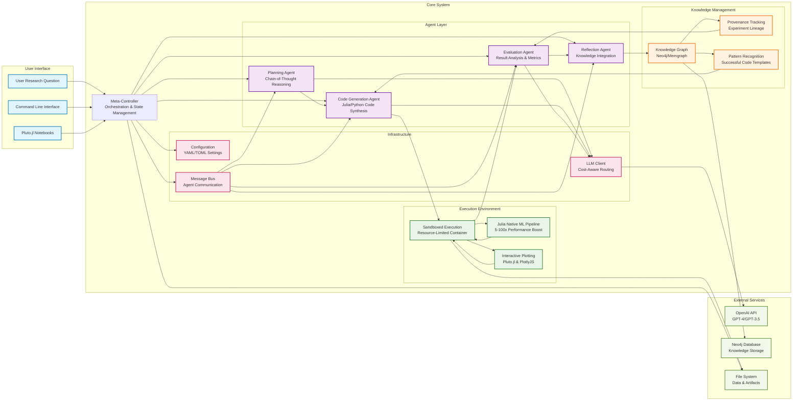
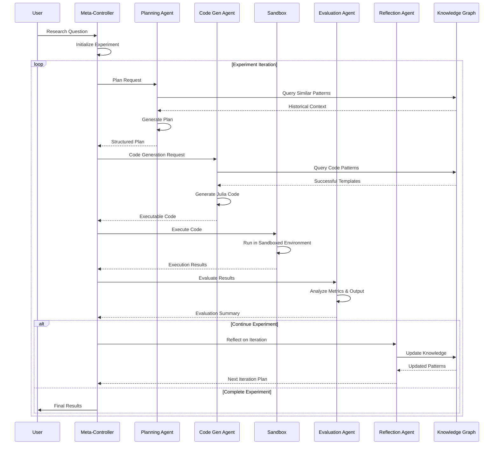
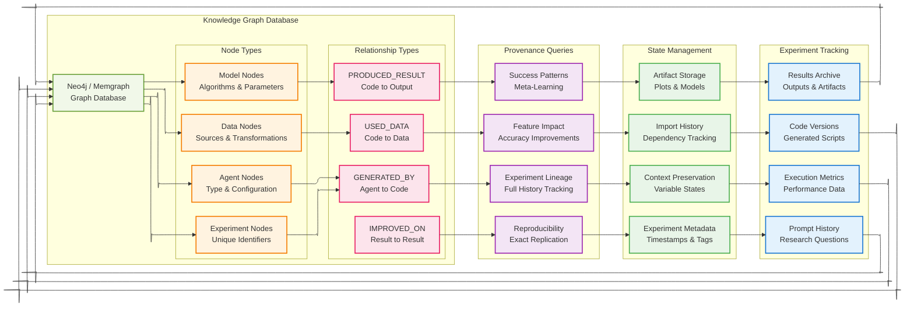
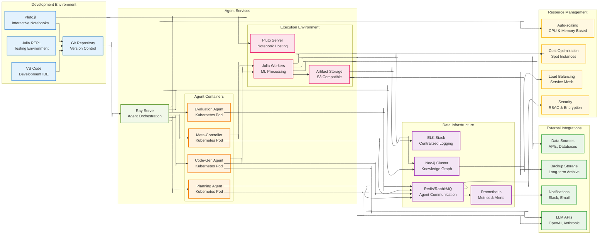

# DSAssist Architecture Diagrams

This document contains comprehensive Mermaid diagrams illustrating the DSAssist system architecture, agent interactions, and data flows.

**Layout Configuration**: These diagrams use adaptive layout with flexible positioning for optimal readability across different screen sizes and viewing contexts.

## 1. High-Level System Architecture



## 2. Agent Communication Flow



## 3. Julia Native ML Pipeline Architecture

```mermaid
%%{init: {"flowchart": {"htmlLabels": true, "curve": "cardinal", "useMaxWidth": true}, "layout": "elk"}}%%
graph LR
    subgraph "Data Input Layer"
        CSV["CSV Files"]
        JSON["JSON Data"]
        API["External APIs"]
        DB["Databases"]
    end
  
    subgraph "Julia Native ML Pipeline"
        LOAD["load_and_prepare_data<br/>Enhanced Data Loading"]
        VALID["validate_data_quality<br/>Missing Values & Duplicates"]
      
        subgraph "Data Processing"
            ENCODE["encode_categorical_features<br/>Robust Encoding"]
            STANDARD["standardize_features<br/>Z-score & MinMax"]
            OUTLIER["detect_outliers<br/>IQR & Z-score Methods"]
        end
      
        subgraph "Model Training"
            SPLIT["train_test_split_julia<br/>Stratified Sampling"]
            CV["cross_validate_model<br/>K-fold Validation"]
            TRAIN["linear_regression_analysis<br/>GLM.jl Integration"]
        end
      
        subgraph "Advanced Analytics"
            BOOTSTRAP["bootstrap_confidence_intervals<br/>Uncertainty Quantification"]
            FEATURE["feature_importance_analysis<br/>Model Interpretability"]
            ENSEMBLE["ensemble_methods<br/>Bootstrap Aggregation"]
        end
    end
  
    subgraph "Performance Benefits"
        SPEED["5-100x Faster<br/>vs Python/sklearn"]
        MEMORY["Memory Efficient<br/>Chunked Processing"]
        TYPE["Type-Safe<br/>Compile-time Optimization"]
    end
  
    subgraph "Output Layer"
        METRICS["Model Metrics<br/>R2, RMSE, Confidence"]
        PLOTS["Visualizations<br/>Interactive Plots"]
        REPORTS["Analysis Reports<br/>Business Insights"]
        MODELS["Trained Models<br/>Serialized Objects"]
    end
  
    CSV --> LOAD
    JSON --> LOAD
    API --> LOAD
    DB --> LOAD
  
    LOAD --> VALID
    VALID --> ENCODE
    ENCODE --> STANDARD
    STANDARD --> OUTLIER
  
    OUTLIER --> SPLIT
    SPLIT --> CV
    CV --> TRAIN
  
    TRAIN --> BOOTSTRAP
    BOOTSTRAP --> FEATURE
    FEATURE --> ENSEMBLE
  
    TRAIN --> SPEED
    STANDARD --> MEMORY
    ENCODE --> TYPE
  
    ENSEMBLE --> METRICS
    FEATURE --> PLOTS
    BOOTSTRAP --> REPORTS
    TRAIN --> MODELS
  
    classDef input fill:#e3f2fd,stroke:#1976d2,stroke-width:2px
    classDef processing fill:#f1f8e9,stroke:#689f38,stroke-width:2px
    classDef training fill:#fff3e0,stroke:#f57c00,stroke-width:2px
    classDef advanced fill:#fce4ec,stroke:#e91e63,stroke-width:2px
    classDef performance fill:#e8f5e8,stroke:#4caf50,stroke-width:2px
    classDef output fill:#f3e5f5,stroke:#9c27b0,stroke-width:2px
  
    class CSV,JSON,API,DB input
    class LOAD,VALID,ENCODE,STANDARD,OUTLIER processing
    class SPLIT,CV,TRAIN training
    class BOOTSTRAP,FEATURE,ENSEMBLE advanced
    class SPEED,MEMORY,TYPE performance
    class METRICS,PLOTS,REPORTS,MODELS output
```



## 4. Interactive Plotting Architecture

```mermaid
%%{init: {"flowchart": {"htmlLabels": true, "curve": "cardinal", "useMaxWidth": true}, "layout": "elk"}}%%
graph LR
    subgraph "Data Sources"
        DATA["Analysis Data<br/>DataFrames & Arrays"]
        MODELS["Model Results<br/>Metrics & Predictions"]
        METRICS["Business Metrics<br/>KPIs & Statistics"]
    end
    
    subgraph "Pluto.jl Interactive Environment"
        NOTEBOOK["Pluto Notebook<br/>Reactive Computing"]
        UI["PlutoUI Controls<br/>Sliders & Selectors"]
        
        subgraph "Plot Generation"
            PLOTS["Plots.jl<br/>Multi-backend System"]
            PLOTLY["PlotlyJS Backend<br/>Interactive Features"]
            GR["GR Backend<br/>Performance Rendering"]
            STATS["StatsPlots<br/>Statistical Visualizations"]
        end
        
        subgraph "Dashboard Components"
            RISK["Risk Assessment<br/>Dynamic Thresholds"]
            VALUE["Customer Analysis<br/>Segmentation Plots"]
            TREND["Trend Analysis<br/>Time Series Plots"]
            DIST["Distribution Analysis<br/>Histograms & Box Plots"]
        end
    end
    
    subgraph "Output Formats"
        INTERACTIVE["Interactive HTML<br/>PlotlyJS Widgets"]
        STATIC["Static Images<br/>PNG, SVG Export"]
        DASHBOARD["Executive Dashboard<br/>Business Reports"]
        EMBED["Embedded Plots<br/>Notebook Integration"]
    end
    
    subgraph "User Interaction"
        PARAMS["Parameter Control<br/>Real-time Updates"]
        ZOOM["Zoom & Pan<br/>Interactive Exploration"]
        FILTER["Data Filtering<br/>Dynamic Queries"]
        EXPORT["Export Options<br/>Multiple Formats"]
    end
    
    %% Data flow connections
    DATA --> NOTEBOOK
    MODELS --> NOTEBOOK
    METRICS --> NOTEBOOK
    
    NOTEBOOK --> UI
    UI --> PLOTS
    PLOTS --> PLOTLY
    PLOTS --> GR
    PLOTS --> STATS
    
    PLOTLY --> RISK
    PLOTLY --> VALUE
    PLOTLY --> TREND
    PLOTLY --> DIST
    
    RISK --> INTERACTIVE
    VALUE --> INTERACTIVE
    TREND --> STATIC
    DIST --> DASHBOARD
    
    INTERACTIVE --> EMBED
    STATIC --> EMBED
    DASHBOARD --> EMBED
    
    UI --> PARAMS
    PLOTLY --> ZOOM
    NOTEBOOK --> FILTER
    EMBED --> EXPORT
    
    %% Styling
    classDef dataSource fill:#e3f2fd,stroke:#1976d2,stroke-width:2px
    classDef environment fill:#f1f8e9,stroke:#689f38,stroke-width:2px
    classDef plotting fill:#fff3e0,stroke:#f57c00,stroke-width:2px
    classDef dashboard fill:#fce4ec,stroke:#e91e63,stroke-width:2px
    classDef output fill:#f3e5f5,stroke:#9c27b0,stroke-width:2px
    classDef interaction fill:#e8f5e8,stroke:#4caf50,stroke-width:2px
    
    class DATA,MODELS,METRICS dataSource
    class NOTEBOOK,UI environment
    class PLOTS,PLOTLY,GR,STATS plotting
    class RISK,VALUE,TREND,DIST dashboard
    class INTERACTIVE,STATIC,DASHBOARD,EMBED output
    class PARAMS,ZOOM,FILTER,EXPORT interaction
```



## 5. Knowledge Graph & Provenance Architecture



## 6. Deployment Architecture



## Usage Instructions

### Embedding in Documentation

To use these diagrams in your documentation, copy the Mermaid code blocks and paste them into any Markdown file. Most modern documentation platforms (GitHub, GitLab, Notion, etc.) support Mermaid rendering.

### Live Editing

You can edit these diagrams using:
- [Mermaid Live Editor](https://mermaid.live/)
- VS Code with Mermaid extension
- GitHub's built-in Mermaid support

### Customization

Each diagram includes CSS classes for styling. You can modify colors and styling by adjusting the `classDef` definitions at the bottom of each diagram.

### Integration with Architecture Documentation

These diagrams complement the existing architecture documentation in:
- `docs/architecture.md` - Detailed technical descriptions
- `docs/configuration.md` - Setup and configuration guides
- `README.md` - High-level overview and quick start
```
