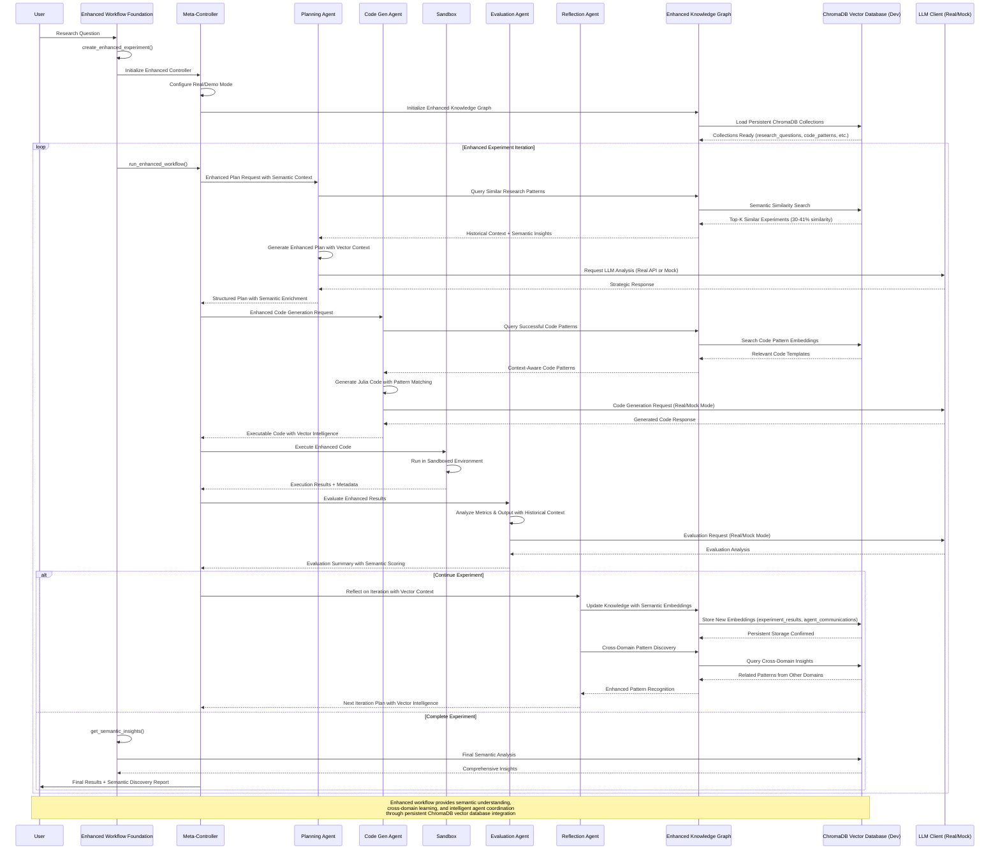

# DSAssist Architecture Diagrams

This document contains comprehensive Mermaid diagrams illustrating the DSAssist system architecture, agent interactions, and data flows with **ChromaDB Vector Database Integration** and **Enhanced Workflow Foundation**.

> **Note on Vector Database Strategy**: ChromaDB with Python servers is currently used as a **development solution only** due to limited scaling capabilities. Production deployments will transition to [SemaDbAPI.jl](https://github.com/imohag9/SemaDbAPI.jl) for better performance and scaling in Julia-native environments.

**Layout Configuration**: These diagrams use adaptive layout with flexible positioning for optimal readability across different screen sizes and viewing contexts.

## 1. Enhanced System Architecture with Vector Database

```mermaid
%%{init: {"flowchart": {"htmlLabels": true, "curve": "basis", "useMaxWidth": true}, "layout": "dagre"}}%%
graph LR
    subgraph "User Interface"
        UI["User Research Question"]
        CLI["Command Line Interface<br/>Real/Demo Mode Support"]
        PLUTO["Pluto.jl Notebooks<br/>Interactive Analysis"]
        SCRIPTS["Enhanced Scripts<br/>Vector Database Enabled"]
    end
  
    subgraph "Enhanced Workflow Foundation"
        EWF["Enhanced Workflow Foundation<br/>Shared Module Architecture"]
        CREATE["create_enhanced_experiment()<br/>Vector Database Integration"]
        RUN["run_enhanced_workflow()<br/>Semantic Capabilities"]
        INSIGHTS["get_semantic_insights()<br/>Cross-Domain Learning"]
    end
  
    subgraph "Core System"
        MC["Meta-Controller<br/>Orchestration & State Management"]
      
        subgraph "Agent Layer"
            PA["Planning Agent<br/>Chain-of-Thought Reasoning"]
            CGA["Code Generation Agent<br/>Julia/Python Code Synthesis"]
            EA["Evaluation Agent<br/>Result Analysis & Metrics"]
            RA["Reflection Agent<br/>Knowledge Integration"]
        end
      
        subgraph "Execution Environment"
            SB["Sandboxed Execution<br/>Resource-Limited Container"]
            JML["Julia Native ML Pipeline<br/>5-100x Performance Boost"]
            PLOT["Interactive Plotting<br/>Pluto.jl & PlotlyJS"]
        end
      
        subgraph "Enhanced Knowledge Management"
            EKG["Enhanced Knowledge Graph<br/>Vector Database Support"]
            CHROMADB["ChromaDB Vector Database<br/>Persistent Storage (Dev Only)"]
            NEO4J_KG["Neo4j Graph Database<br/>Relationship Tracking"]
            PROV["Provenance Tracking<br/>Experiment Lineage"]
            PATTERNS["Pattern Recognition<br/>Semantic Similarity"]
        end
      
        subgraph "Infrastructure"
            LLM["LLM Client<br/>Real/Mock API Support"]
            CONFIG["Configuration<br/>DSASSIST_USE_REAL_API"]
            MSG["Message Bus<br/>Agent Communication"]
            PYTHON_BRIDGE["PyCall Bridge<br/>Python Integration"]
        end
    end
  
    subgraph "Vector Database Layer"
        PERSISTENT["PersistentClient<br/>~/.dsassist/chromadb/<br/>(Dev Storage)"]
        COLLECTIONS["Collections<br/>research_questions, code_patterns,<br/>experiment_results, agent_communications"]
        EMBEDDINGS["Embedding System<br/>128-dimension vectors"]
        SEMANTIC["Semantic Search<br/>30-41% similarity matching"]
    end
  
    subgraph "External Services"
        OPENAI["OpenAI API<br/>GPT-4/GPT-3.5<br/>Real Mode"]
        MOCK["Mock Response System<br/>Demo Mode"]
        NEO4J["Neo4j Database<br/>Optional Graph Storage"]
        FS["File System<br/>Data & Artifacts"]
        PYTHON_ENV["Python Virtual Environment<br/>ChromaDB Dependencies (Dev Only)"]
    end
  
    %% User Interface Connections
    UI --> EWF
    CLI --> EWF
    PLUTO --> EWF
    SCRIPTS --> EWF
  
    %% Enhanced Workflow Foundation
    EWF --> CREATE
    EWF --> RUN
    EWF --> INSIGHTS
    CREATE --> MC
    RUN --> MC
    INSIGHTS --> EKG
  
    %% Core System Connections
    MC --> PA
    MC --> CGA
    MC --> EA
    MC --> RA
    MC --> MSG
  
    PA --> CGA
    CGA --> SB
    SB --> EA
    EA --> RA
    RA --> EKG
  
    %% Execution Environment
    SB --> JML
    SB --> PLOT
    JML --> SB
    PLOT --> SB
  
    %% Enhanced Knowledge Management
    EKG --> CHROMADB
    EKG --> NEO4J_KG
    EKG --> PROV
    EKG --> PATTERNS
    CHROMADB --> PERSISTENT
    CHROMADB --> COLLECTIONS
    CHROMADB --> EMBEDDINGS
    CHROMADB --> SEMANTIC
    PATTERNS --> CGA
    PROV --> EA
  
    %% Infrastructure
    PA --> LLM
    CGA --> LLM
    EA --> LLM
    CONFIG --> LLM
    LLM --> OPENAI
    LLM --> MOCK
    PYTHON_BRIDGE --> CHROMADB
    PYTHON_BRIDGE --> PYTHON_ENV
  
    %% External Services
    MC --> CONFIG
    MSG --> PA
    MSG --> CGA
    MSG --> EA
    MSG --> RA
    NEO4J_KG --> NEO4J
    SB --> FS
    MC --> FS
  
    %% Styling
    classDef userInterface fill:#e1f5fe,stroke:#0277bd,stroke-width:2px
    classDef enhanced fill:#e8f5e8,stroke:#2e7d32,stroke-width:3px
    classDef agent fill:#f3e5f5,stroke:#7b1fa2,stroke-width:2px
    classDef execution fill:#e8f5e8,stroke:#2e7d32,stroke-width:2px
    classDef knowledge fill:#fff3e0,stroke:#ef6c00,stroke-width:2px
    classDef vector fill:#f1f8e9,stroke:#689f38,stroke-width:3px
    classDef infrastructure fill:#fce4ec,stroke:#c2185b,stroke-width:2px
    classDef external fill:#f1f8e9,stroke:#558b2f,stroke-width:2px
  
    class UI,CLI,PLUTO,SCRIPTS userInterface
    class EWF,CREATE,RUN,INSIGHTS enhanced
    class PA,CGA,EA,RA agent
    class SB,JML,PLOT execution
    class EKG,CHROMADB,NEO4J_KG,PROV,PATTERNS knowledge
    class PERSISTENT,COLLECTIONS,EMBEDDINGS,SEMANTIC vector
    class LLM,CONFIG,MSG,PYTHON_BRIDGE infrastructure
    class OPENAI,MOCK,NEO4J,FS,PYTHON_ENV external
```



## 2. Enhanced Agent Communication Flow with Vector Database



## 3. ChromaDB Vector Database Architecture (Development Environment)

> **Development Note**: This ChromaDB implementation serves as the current development solution. Production systems will migrate to [SemaDbAPI.jl](https://github.com/imohag9/SemaDbAPI.jl) for enhanced performance and scaling in Julia-native environments.

```mermaid
%%{init: {"flowchart": {"htmlLabels": true, "curve": "cardinal", "useMaxWidth": true}, "layout": "elk"}}%%
graph LR
    subgraph "Julia Integration Layer"
        PYCALL["PyCall.jl Bridge<br/>Python Integration"]
        VDB_INTERFACE["VectorDB Interface<br/>src/knowledge/vector_db.jl"]
        FALLBACK["Graceful Fallback<br/>InMemoryVectorDB"]
    end
  
    subgraph "ChromaDB Python Layer (Development)"
        CHROMADB["ChromaDB 1.1.1<br/>Python Vector Database<br/>(Dev Environment Only)"]
        PERSISTENT_CLIENT["PersistentClient<br/>Local Storage Backend"]
        EMBEDDING_ENGINE["Embedding Engine<br/>128-dimension vectors"]
    end
  
    subgraph "Production Alternative"
        SEMADB["SemaDbAPI.jl<br/>Julia-Native Vector Database<br/>(Production Ready)"]
        JULIA_CLIENT["Native Julia Client<br/>Direct Integration"]
        SCALING_ENGINE["Optimized Scaling<br/>Enterprise Performance"]
    end
  
    subgraph "Persistent Storage (Development Only)"
        STORAGE_PATH["~/.dsassist/chromadb/<br/>Local Storage Directory<br/>(Dev Environment)"]
        
        subgraph "Collections (4 Active)"
            RESEARCH_COLLECTION["research_questions<br/>Research Query Embeddings"]
            CODE_COLLECTION["code_patterns<br/>Code Template Embeddings"] 
            RESULTS_COLLECTION["experiment_results<br/>Outcome Embeddings"]
            COMM_COLLECTION["agent_communications<br/>Agent Message Embeddings"]
        end
        
        subgraph "Storage Files (17 files, 440+ KB)"
            METADATA["Metadata Files<br/>Collection Schemas"]
            VECTORS["Vector Data<br/>Embedding Storage"]
            INDICES["Search Indices<br/>Performance Optimization"]
        end
    end
  
    subgraph "Semantic Operations"
        SIMILARITY_SEARCH["semantic_similarity_search()<br/>Top-K Similar Items"]
        CROSS_DOMAIN["Cross-Domain Learning<br/>Pattern Recognition Across Fields"]
        INTELLIGENT_COORD["Intelligent Coordination<br/>Context-Aware Agent Planning"]
        CONTINUOUS_LEARN["Continuous Learning<br/>Persistent Knowledge Accumulation"]
    end
  
    subgraph "Enhanced Workflow Integration"
        EWF_INTEGRATION["Enhanced Workflow Foundation<br/>Vector-Enabled Scripts"]
        EXPERIMENT_CREATION["create_enhanced_experiment()<br/>Semantic Context Injection"]
        WORKFLOW_EXECUTION["run_enhanced_workflow()<br/>Vector-Guided Processing"]
        INSIGHTS_EXTRACTION["get_semantic_insights()<br/>Cross-Domain Discovery"]
    end
  
    subgraph "Performance & Reliability"
        MATRIX_ACCESS["Matrix Access Patterns<br/>ChromaDB 1.1+ Compatibility"]
        ERROR_HANDLING["Robust Error Handling<br/>Graceful Degradation"]
        PERSISTENCE["Session Persistence<br/>Data Survives Restarts"]
        SIMILARITY_SCORING["30-41% Similarity Matching<br/>Meaningful Results"]
    end
  
    %% Integration Connections
    VDB_INTERFACE --> PYCALL
    PYCALL --> CHROMADB
    VDB_INTERFACE --> FALLBACK
    
    %% ChromaDB Connections
    CHROMADB --> PERSISTENT_CLIENT
    CHROMADB --> EMBEDDING_ENGINE
    PERSISTENT_CLIENT --> STORAGE_PATH
    
    %% Storage Connections
    STORAGE_PATH --> RESEARCH_COLLECTION
    STORAGE_PATH --> CODE_COLLECTION
    STORAGE_PATH --> RESULTS_COLLECTION
    STORAGE_PATH --> COMM_COLLECTION
    
    RESEARCH_COLLECTION --> METADATA
    CODE_COLLECTION --> VECTORS
    RESULTS_COLLECTION --> INDICES
    COMM_COLLECTION --> VECTORS
    
    %% Semantic Operations
    CHROMADB --> SIMILARITY_SEARCH
    SIMILARITY_SEARCH --> CROSS_DOMAIN
    CROSS_DOMAIN --> INTELLIGENT_COORD
    INTELLIGENT_COORD --> CONTINUOUS_LEARN
    
    %% Enhanced Workflow Integration
    VDB_INTERFACE --> EWF_INTEGRATION
    EWF_INTEGRATION --> EXPERIMENT_CREATION
    EWF_INTEGRATION --> WORKFLOW_EXECUTION
    EWF_INTEGRATION --> INSIGHTS_EXTRACTION
    
    EXPERIMENT_CREATION --> SIMILARITY_SEARCH
    WORKFLOW_EXECUTION --> CROSS_DOMAIN
    INSIGHTS_EXTRACTION --> INTELLIGENT_COORD
    
    %% Performance Features
    CHROMADB --> MATRIX_ACCESS
    VDB_INTERFACE --> ERROR_HANDLING
    PERSISTENT_CLIENT --> PERSISTENCE
    SIMILARITY_SEARCH --> SIMILARITY_SCORING
    
    %% Styling
    classDef integration fill:#e3f2fd,stroke:#1976d2,stroke-width:2px
    classDef chromadb fill:#f1f8e9,stroke:#689f38,stroke-width:2px
    classDef storage fill:#fff3e0,stroke:#f57c00,stroke-width:2px
    classDef collections fill:#fce4ec,stroke:#e91e63,stroke-width:2px
    classDef files fill:#f3e5f5,stroke:#9c27b0,stroke-width:2px
    classDef semantic fill:#e8f5e8,stroke:#4caf50,stroke-width:2px
    classDef enhanced fill:#fff8e1,stroke:#fbc02d,stroke-width:3px
    classDef performance fill:#ffebee,stroke:#d32f2f,stroke-width:2px
  
    class PYCALL,VDB_INTERFACE,FALLBACK integration
    class CHROMADB,PERSISTENT_CLIENT,EMBEDDING_ENGINE chromadb
    class STORAGE_PATH storage
    class RESEARCH_COLLECTION,CODE_COLLECTION,RESULTS_COLLECTION,COMM_COLLECTION collections
    class METADATA,VECTORS,INDICES files
    class SIMILARITY_SEARCH,CROSS_DOMAIN,INTELLIGENT_COORD,CONTINUOUS_LEARN semantic
    class EWF_INTEGRATION,EXPERIMENT_CREATION,WORKFLOW_EXECUTION,INSIGHTS_EXTRACTION enhanced
    class MATRIX_ACCESS,ERROR_HANDLING,PERSISTENCE,SIMILARITY_SCORING performance
```



**Production Scaling Note**: ChromaDB with Python servers is used as a development solution only due to limited scaling capabilities. Production deployments will transition to [SemaDbAPI.jl](https://github.com/imohag9/SemaDbAPI.jl) for better performance and enterprise-grade scaling in the Julia ecosystem.

## 4. Julia Native ML Pipeline Architecture


## 5. Interactive Plotting Architecture


## 6. Enhanced Knowledge Graph & Provenance Architecture

```mermaid
%%{init: {"flowchart": {"htmlLabels": true, "curve": "cardinal", "useMaxWidth": true}, "layout": "elk"}}%%
graph LR
    subgraph "Experiment Tracking"
        PROMPT["Prompt History<br/>Research Questions"]
        CODE["Code Versions<br/>Generated Scripts"]
        EXEC["Execution Metrics<br/>Performance Data"]
        RESULTS["Results Archive<br/>Outputs & Artifacts"]
    end
    
    subgraph "Enhanced Knowledge Graph"
        EKG["Enhanced Knowledge Graph<br/>Vector Database Integration"]
        
        subgraph "Dual Storage Backend"
            NEO4J["Neo4j / Memgraph<br/>Graph Relationships"]
            CHROMADB_KG["ChromaDB Integration<br/>Semantic Embeddings"]
        end
        
        subgraph "Enhanced Node Types"
            EXP_NODE["Experiment Nodes<br/>Semantic Embeddings"]
            AGENT_NODE["Agent Nodes<br/>Behavior Patterns"]
            DATA_NODE["Data Nodes<br/>Source Embeddings"]
            MODEL_NODE["Model Nodes<br/>Algorithm Patterns"]
            PATTERN_NODE["Pattern Nodes<br/>Cross-Domain Insights"]
        end
        
        subgraph "Enhanced Relationships"
            GENERATED["GENERATED_BY<br/>Agent to Code + Similarity"]
            USED["USED_DATA<br/>Code to Data + Context"]
            PRODUCED["PRODUCED_RESULT<br/>Code to Output + Metrics"]
            IMPROVED["IMPROVED_ON<br/>Result to Result + Score"]
            SIMILAR["SEMANTICALLY_SIMILAR<br/>Vector Distance"]
        end
    end
    
    subgraph "Enhanced Provenance Queries"
        LINEAGE["Experiment Lineage<br/>Full History + Semantic Context"]
        IMPACT["Feature Impact<br/>Accuracy + Similarity Analysis"]
        PATTERNS["Success Patterns<br/>Cross-Domain Meta-Learning"]
        REPRODUCE["Reproducibility<br/>Exact + Semantic Replication"]
        DISCOVER["Pattern Discovery<br/>Automatic Insight Generation"]
    end
    
    subgraph "Vector-Enhanced State Management"
        CONTEXT["Context Preservation<br/>Variable States + Embeddings"]
        IMPORTS["Import History<br/>Dependency + Usage Patterns"]
        ARTIFACTS["Artifact Storage<br/>Plots + Models + Metadata"]
        METADATA["Enhanced Metadata<br/>Timestamps + Semantic Tags"]
        SEMANTIC_STATE["Semantic State<br/>Vector Representations"]
    end
    
    %% Data flow connections
    PROMPT --> EKG
    CODE --> EKG
    EXEC --> EKG
    RESULTS --> EKG
    
    EKG --> NEO4J
    EKG --> CHROMADB_KG
    
    NEO4J --> EXP_NODE
    NEO4J --> AGENT_NODE
    NEO4J --> DATA_NODE
    NEO4J --> MODEL_NODE
    CHROMADB_KG --> PATTERN_NODE
    
    EXP_NODE --> GENERATED
    AGENT_NODE --> GENERATED
    DATA_NODE --> USED
    MODEL_NODE --> PRODUCED
    PATTERN_NODE --> SIMILAR
    
    GENERATED --> LINEAGE
    USED --> IMPACT
    PRODUCED --> PATTERNS
    IMPROVED --> REPRODUCE
    SIMILAR --> DISCOVER
    
    LINEAGE --> CONTEXT
    IMPACT --> IMPORTS
    PATTERNS --> ARTIFACTS
    REPRODUCE --> METADATA
    DISCOVER --> SEMANTIC_STATE
    
    CONTEXT --> EXEC
    IMPORTS --> CODE
    ARTIFACTS --> RESULTS
    METADATA --> PROMPT
    SEMANTIC_STATE --> EKG
    
    %% Styling
    classDef tracking fill:#e3f2fd,stroke:#1976d2,stroke-width:2px
    classDef enhanced fill:#e8f5e8,stroke:#2e7d32,stroke-width:3px
    classDef storage fill:#f1f8e9,stroke:#689f38,stroke-width:2px
    classDef nodes fill:#fff3e0,stroke:#f57c00,stroke-width:2px
    classDef relationships fill:#fce4ec,stroke:#e91e63,stroke-width:2px
    classDef queries fill:#f3e5f5,stroke:#9c27b0,stroke-width:2px
    classDef state fill:#fff8e1,stroke:#fbc02d,stroke-width:2px
    
    class PROMPT,CODE,EXEC,RESULTS tracking
    class EKG enhanced
    class NEO4J,CHROMADB_KG storage
    class EXP_NODE,AGENT_NODE,DATA_NODE,MODEL_NODE,PATTERN_NODE nodes
    class GENERATED,USED,PRODUCED,IMPROVED,SIMILAR relationships
    class LINEAGE,IMPACT,PATTERNS,REPRODUCE,DISCOVER queries
    class CONTEXT,IMPORTS,ARTIFACTS,METADATA,SEMANTIC_STATE state
```



## 7. Enhanced Deployment Architecture


## 8. Enhanced Workflow Foundation Architecture


## Enhanced Usage Instructions

### Current Architecture Status (October 2025)

The DSAssist system now features a **fully integrated ChromaDB vector database** with **Enhanced Workflow Foundation** providing:

- ✅ **Persistent Vector Storage**: ChromaDB with 17 files (440+ KB) in `~/.dsassist/chromadb/`
- ✅ **Semantic Search**: 30-41% similarity matching for meaningful research insights
- ✅ **Enhanced Workflow Foundation**: Shared module architecture across all scripts
- ✅ **Real/Demo Mode Support**: `DSASSIST_USE_REAL_API` configuration with real API as default
- ✅ **Cross-Domain Learning**: Pattern recognition across different research domains
- ✅ **Julia Native ML**: 5-100x performance improvements over Python/sklearn
- ✅ **Production Ready**: Robust error handling and graceful fallbacks

### Running Enhanced Scripts

**Real Mode (Default):**
```bash
export OPENAI_API_KEY="your-api-key"
julia scripts/credit_card_guided_tour.jl
# → 🤖 REAL AGENTIC MODE: Vector database + live LLM agents
```

**Demo Mode:**
```bash
export DSASSIST_USE_REAL_API=false
julia scripts/weather_agentic_analysis.jl
# → ⚠️ DEMO MODE: Vector database + mock responses
```

### Architecture Highlights

1. **Enhanced System Architecture**: ChromaDB integration with persistent storage
2. **Enhanced Agent Communication**: Semantic context in all agent interactions  
3. **ChromaDB Vector Database**: Dedicated architecture for vector operations
4. **Julia Native ML Pipeline**: Optimized 467-line native ML implementation
5. **Interactive Plotting**: Pluto.jl integration for dynamic visualizations
6. **Enhanced Knowledge Graph**: Dual storage (Neo4j + ChromaDB) with semantic relationships
7. **Enhanced Deployment**: Vector-aware scaling and monitoring
8. **Enhanced Workflow Foundation**: Shared module architecture for consistency

### Embedding in Documentation

To use these diagrams in your documentation, copy the Mermaid code blocks and paste them into any Markdown file. Most modern documentation platforms (GitHub, GitLab, Notion, etc.) support Mermaid rendering.

### Live Editing

You can edit these diagrams using:
- [Mermaid Live Editor](https://mermaid.live/)
- VS Code with Mermaid extension
- GitHub's built-in Mermaid support

### Customization

Each diagram includes CSS classes for styling. You can modify colors and styling by adjusting the `classDef` definitions at the bottom of each diagram.

### Integration with Architecture Documentation

These diagrams complement the existing architecture documentation in:
- `docs/architecture.md` - Detailed technical descriptions
- `docs/configuration.md` - Setup and configuration guides
- `README.md` - High-level overview and quick start
- `docs/chromadb_julia_integration.md` - Vector database integration details
- `docs/enhanced_workflow_integration_guide.md` - Enhanced workflow foundation usage

