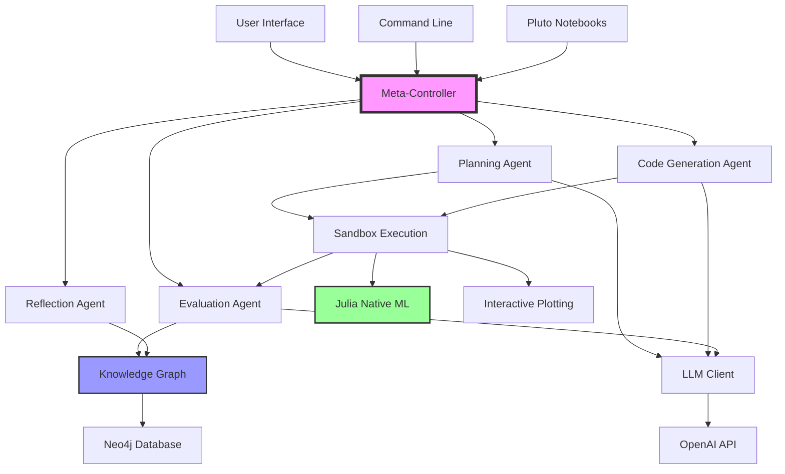
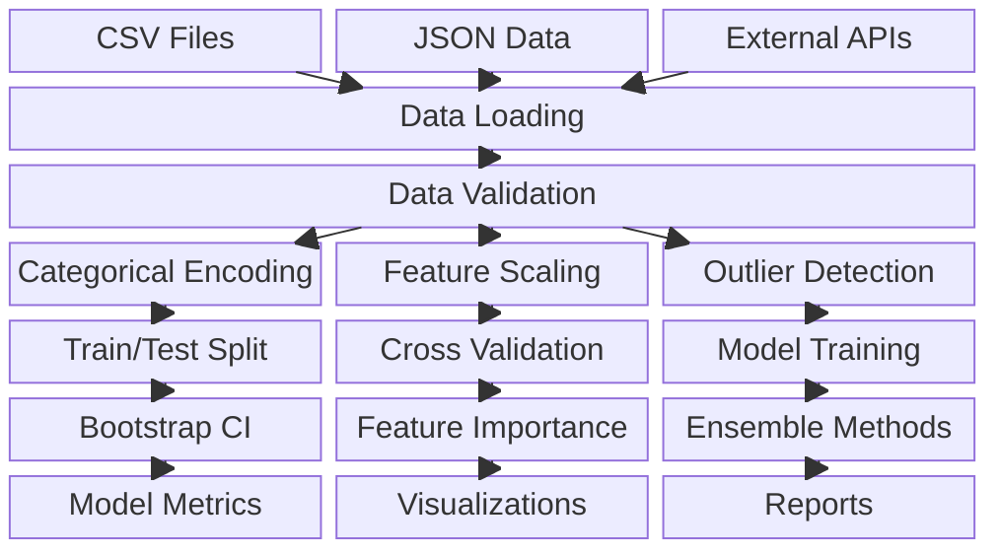
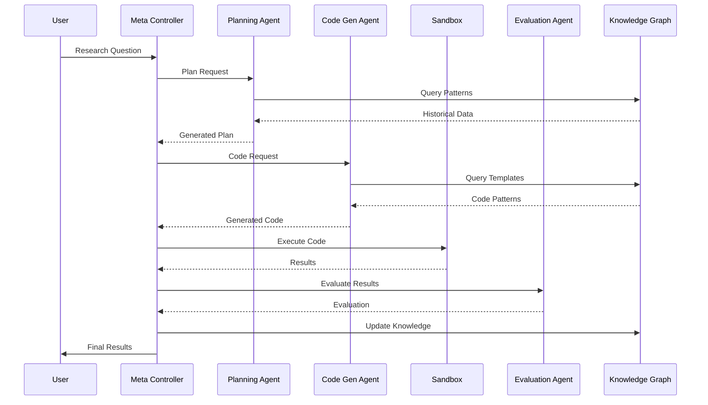
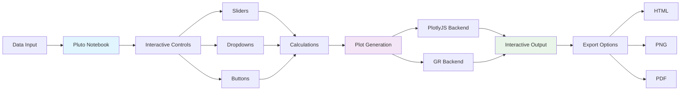
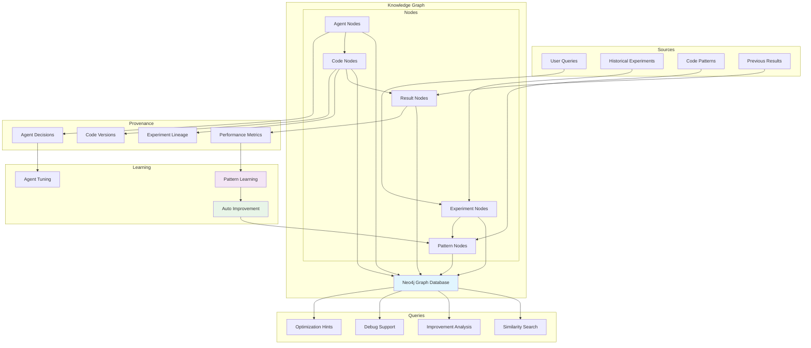
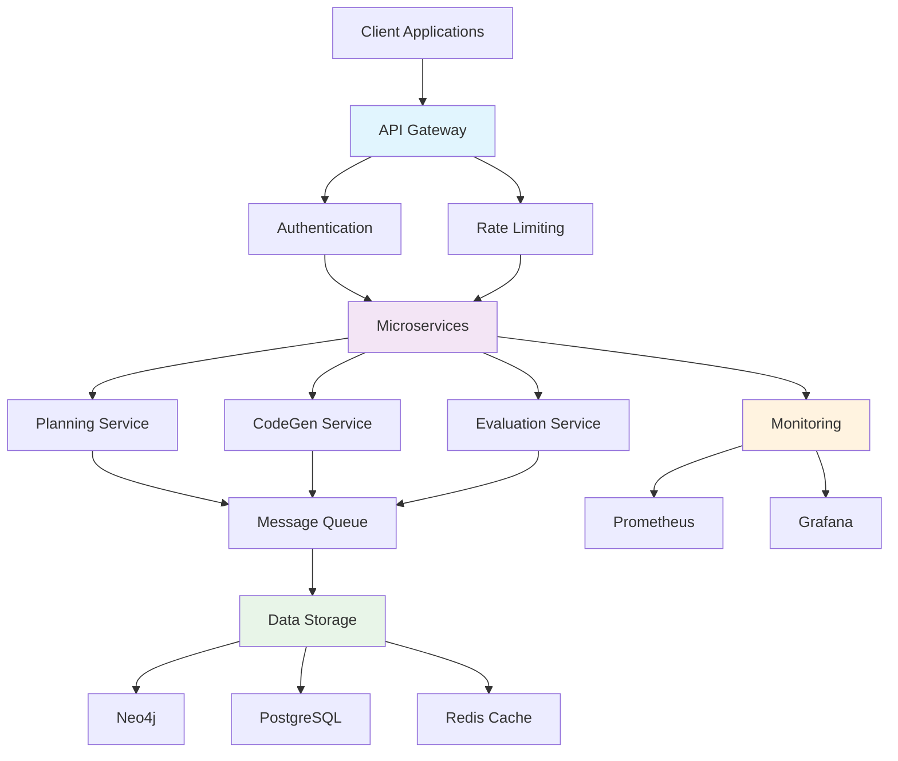

# DSAssist Architecture Diagrams (Compatible Version)

This document contains Mermaid diagrams with enhanced compatibility for older versions of Mermaid (8.8.0+).

## 1. High-Level System Architecture (Flowchart)

## 2. Julia ML Pipeline (Block Diagram)

## 3. Agent Communication Flow (Sequence)

## 4. Interactive Plotting Architecture

## 5. Knowledge Graph Structure

## 6. Deployment Architecture

## Usage Notes

### Compatibility
- These diagrams are compatible with Mermaid 8.8.0+
- Removed special characters that might cause parsing issues
- Simplified syntax for better rendering across platforms

### Alternative Formats
If you still encounter issues, try:
1. Using the block diagram format (shown in example 2)
2. Converting to flowchart format (shown in examples 1, 4, 6)
3. Using sequence diagrams for process flows (example 3)

### Troubleshooting
- Remove any special characters (², &, etc.)
- Use double quotes for all node labels
- Avoid HTML line breaks in older versions
- Simplify complex subgraph structures